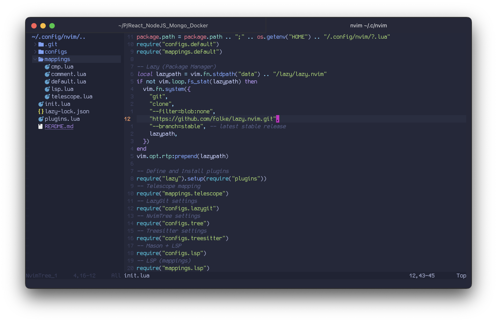

# nvim
Config for NeoVim >=0.11.0

### Plugins
- Package Manager - Lazy.nvim
- Finder, Filter, Previews - Telescope
- File Explorer - Nvim Tree
- Code highlighters - Treesitter
- Language things supporter (like go to defenition and etc) - LSP + Mason
- Formatter, Diagnostic (here we can define eslint, prettier, and etc) - Null-ls
- Terminal inside Neovim - NvChad Terminal
- Autocomplete, suggests, snippets - CMP
